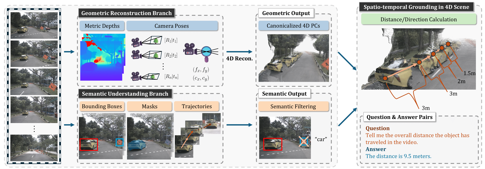

# ST-VLM: Kinematic Instruction Tuning for Spatio-Temporal Reasoning in Vision-Language Models

> Dohwan Ko<sup>1*</sup>, Sihyeon Kim<sup>1*</sup>, Yumin Suh<sup>2</sup>, Vijay Kumar<sup>2</sup>, Minseo Yoon<sup>1</sup>, Manmohan Chandraker<sup>2,3</sup>, Hyunwoo J. Kim<sup>4</sup>
>
> <sup>1</sup>Korea University   <sup>2</sup>NEC Labs America  <sup>3</sup>UC San Diego  <sup>4</sup>KAIST

<p align="center">
  <a href="https://arxiv.org/abs/2503.19355"></a>
	<a href=""></a>
  <a href=""></a>
  <a href="https://ikodoh.github.io/ST-VLM"></a>
</p>


Code will be available soon!


<div align="center">
  
</div>


## Citations

```
@article{ko2025st,
  title={ST-VLM: Kinematic Instruction Tuning for Spatio-Temporal Reasoning in Vision-Language Models},
  author={Ko, Dohwan and Kim, Sihyeon and Suh, Yumin and Yoon, Minseo and Chandraker, Manmohan and Kim, Hyunwoo J and others},
  journal={arXiv preprint arXiv:2503.19355},
  year={2025}
}
```
